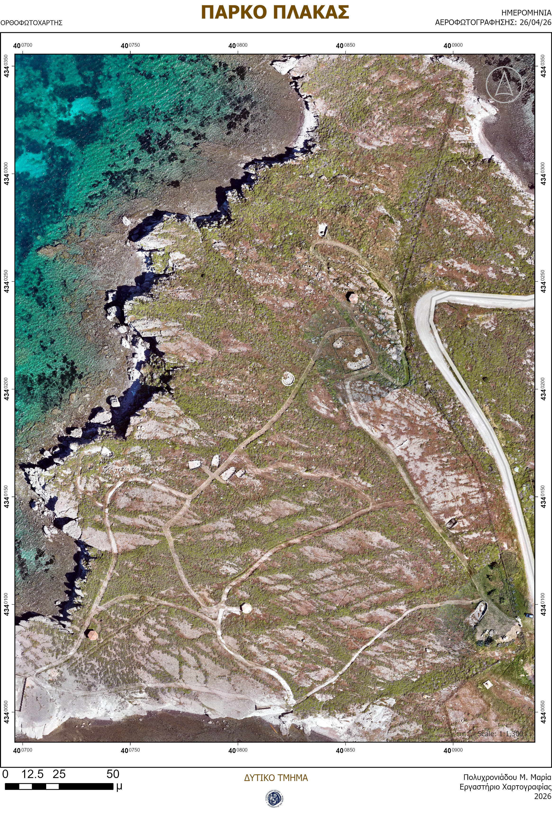
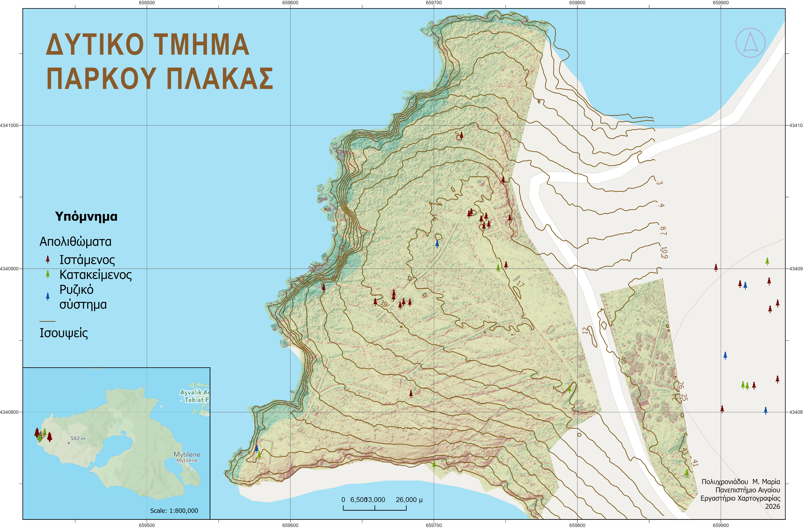
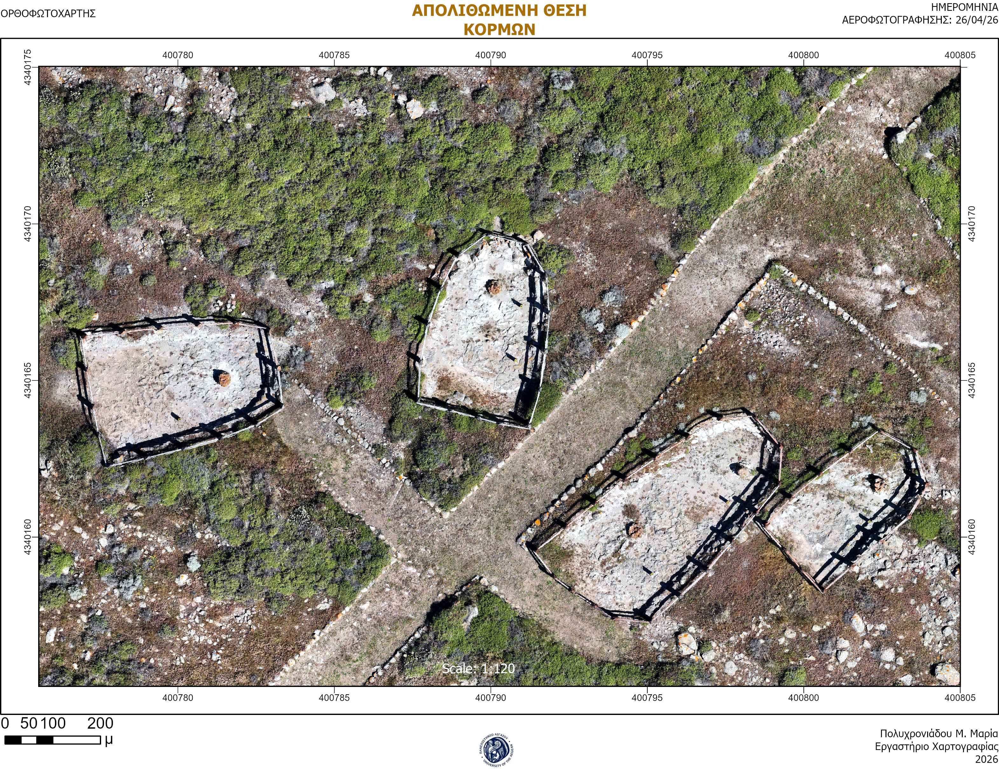
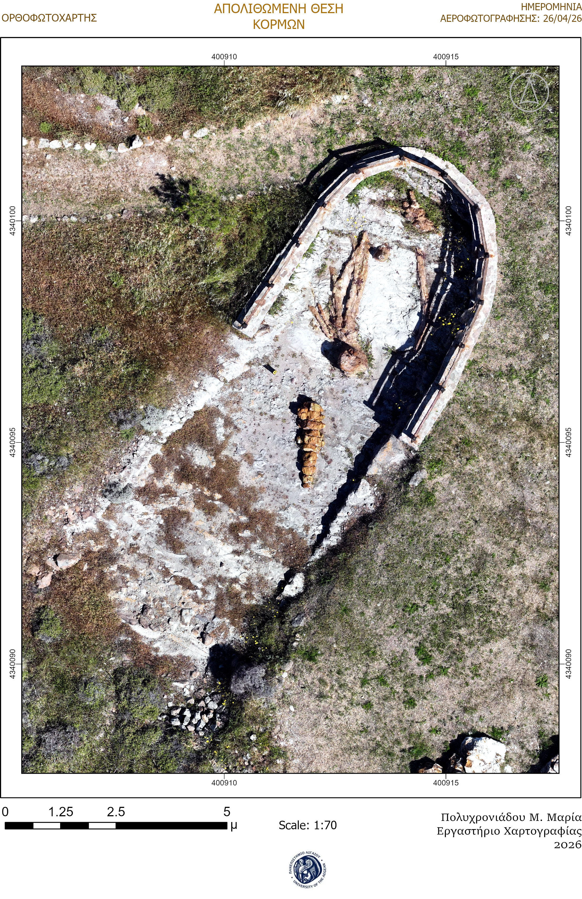
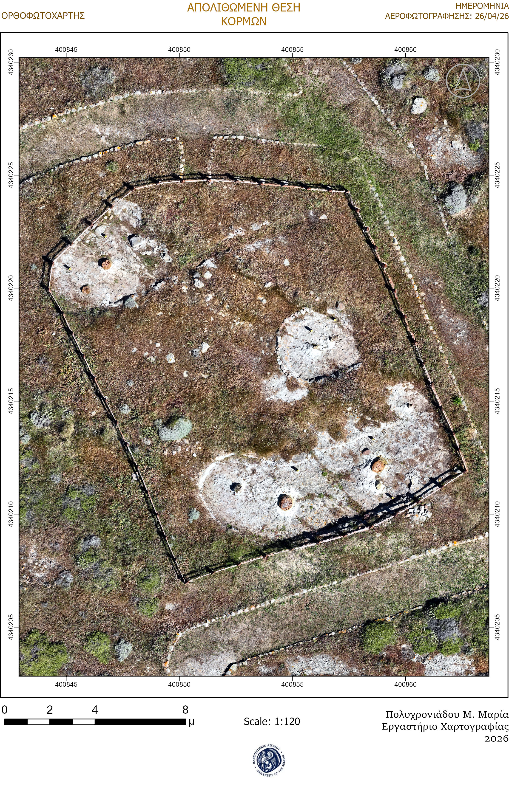
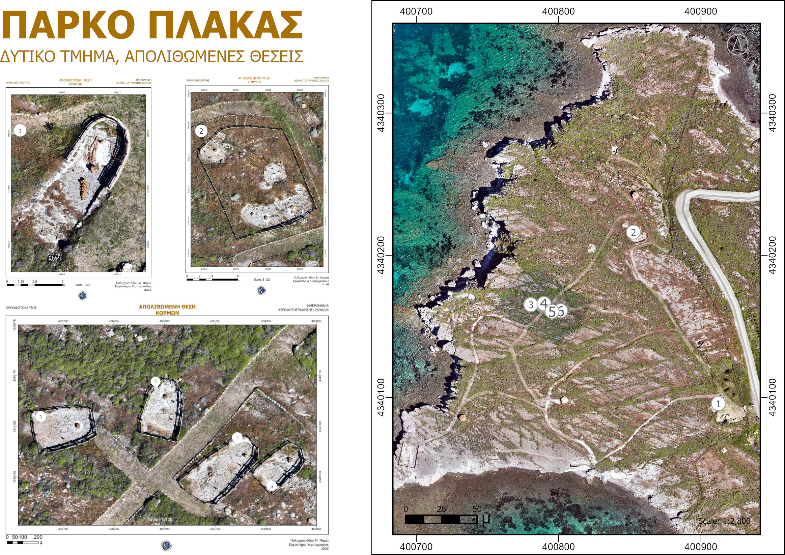

# Lesvos-Geopark
A collection of maps for Lesvos Geopark.  Lesvos has a unique wealth of geological monuments and landscapes of natural beauty, habitats and cultural monuments which have contributed to its recognition and inclusion in the Global Geoparks Network of UNESCO

